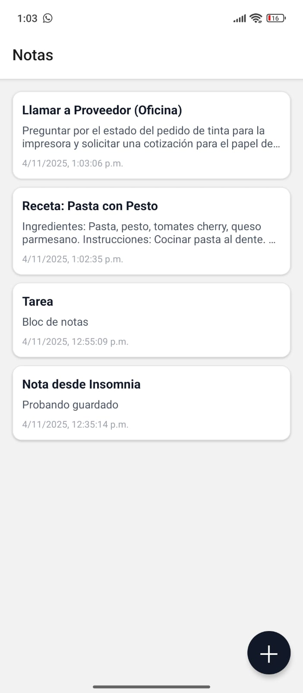
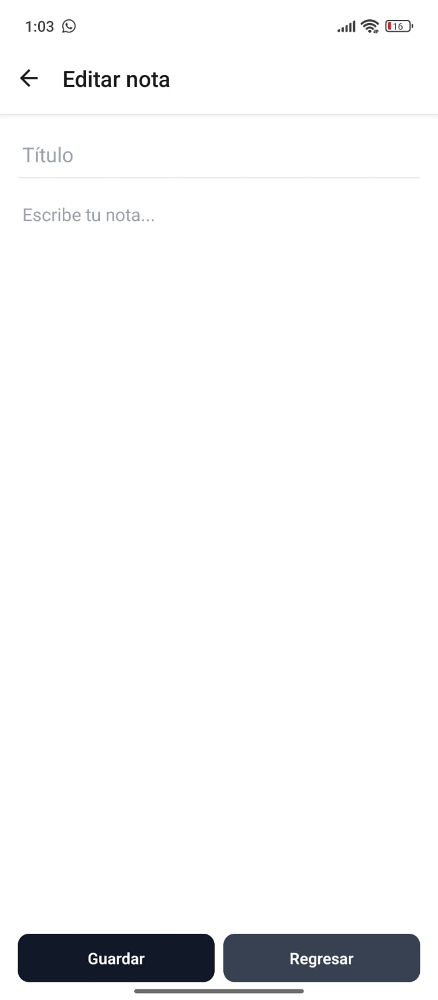
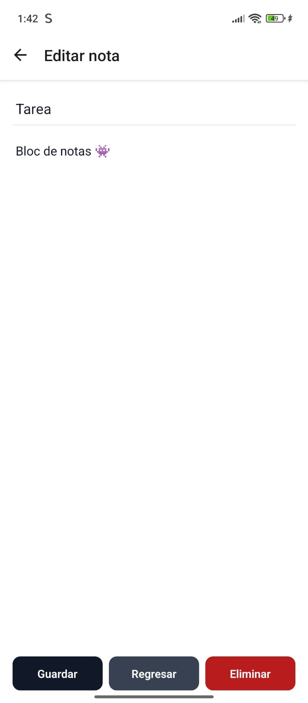
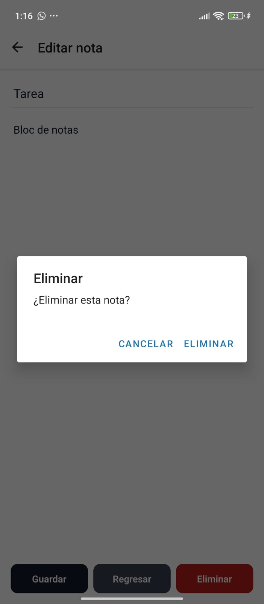

# Bloc de Notas - App Móvil

## 1. Identificación del Proyecto

* **Nombre de la App:** Bloc de Notas
* **Asignatura/Profesor:** Desarrollo de Aplicaciones Móviles
* **Periodo/Fecha:** 2025
* **URL del Repositorio:** <https://github.com/xanderdragon801/BlocNotas.git>

## 2. Descripción del Proyecto

Bloc de Notas es una aplicación móvil desarrollada con React Native y Expo que permite a los usuarios crear, editar, eliminar y gestionar notas de texto. La aplicación se conecta a un backend API para persistir las notas en el servidor, ofreciendo una experiencia de usuario moderna y fluida con navegación entre pantallas.

### Características Principales:

* **Gestión Completa de Notas**: Crear, editar y eliminar notas con título y contenido
* **Sincronización con Backend**: Las notas se almacenan en un servidor API
* **Interfaz Moderna**: Diseño limpio y minimalista con componentes nativos
* **Pull to Refresh**: Actualiza la lista de notas deslizando hacia abajo
* **Navegación Intuitiva**: Navegación Stack entre lista y editor de notas
* **Confirmación de Eliminación**: Diálogos de confirmación para evitar eliminaciones accidentales
* **Empty State**: Mensaje informativo cuando no hay notas
* **Keyboard Avoidance**: El teclado no cubre los campos de entrada
* Diseño responsivo y optimizado para móviles
* Estructura de código modular y escalable

## 3. Tecnologías y Versiones Utilizadas

### Stack Tecnológico:

* **React Native:** 0.81.5
* **React:** 19.1.0
* **Expo:** ~54.0.22
* **React Navigation:** v7.1.19 (Stack Navigator v7.6.2)
* **React Native Screens:** ~4.16.0
* **React Native Safe Area Context:** ~5.6.0
* **Axios:** ^1.13.1

### Herramientas de Desarrollo Requeridas:

* **Node.js:** v18.17.0 o superior  
```bash
node --version
```

* **NPM:** 9.0.0+ o Yarn v1.22.19+  
```bash
npm --version
# o
yarn --version
```

* **Expo CLI:** v6.3.0+  
```bash
npx expo --version
```

* **Android Studio:** v2022.3+ con Android SDK 33+ **o** Expo Go app en dispositivo físico  
```bash
# Verificar Android SDK
adb --version
```

### Verificación de Entorno:

```bash
npx expo doctor
```

### Dependencias del Proyecto:

| Dependencia                    | Versión  | Propósito                                                          |
| ------------------------------ | -------- | ------------------------------------------------------------------ |
| @react-navigation/native       | ^7.1.19  | Core de navegación entre pantallas, manejo de estado de navegación |
| @react-navigation/stack        | ^7.6.2   | Stack navigator para navegación jerárquica (Lista → Editor)        |
| react-native-screens           | ~4.16.0  | Optimización de rendimiento para transiciones nativas              |
| react-native-safe-area-context| ~5.6.0   | Manejo de áreas seguras (notch, barras de estado)                  |
| react-native-gesture-handler   | ~2.28.0  | Manejo de gestos táctiles                                          |
| axios                          | ^1.13.1  | Cliente HTTP para comunicación con el backend API                   |
| expo                           | ~54.0.22 | Framework de desarrollo móvil                                      |
| react                          | 19.1.0   | Biblioteca de interfaz de usuario                                  |
| react-native                   | 0.81.5   | Framework de desarrollo móvil multiplataforma                      |

### DevDependencies:

| Dependencia                    | Versión  | Propósito                                                          |
| ------------------------------ | -------- | ------------------------------------------------------------------ |
| @types/react                  | ~19.1.10 | Tipos TypeScript para React                                       |
| babel-plugin-module-resolver   | ^5.0.2   | Resolución de módulos con alias (@/)                              |
| typescript                     | ~5.9.2   | Soporte TypeScript                                                 |

## 4. Estructura del Proyecto

### Organización de Archivos:

```
notas/
├── App.js                          # Componente principal de la aplicación
├── app.json                        # Configuración de Expo
├── package.json                    # Dependencias y scripts
├── index.js                        # Punto de entrada
├── babel.config.js                 # Configuración de Babel
├── metro.config.js                 # Configuración de Metro Bundler
├── assets/                         # Recursos estáticos
│   ├── adaptive-icon.png
│   ├── favicon.png
│   ├── icon.png
│   └── splash-icon.png
├── docs/                           # Documentación y capturas
│   ├── CrearNota.jpg
│   ├── EditarNota.jpg
│   ├── EliminarNota.jpg
│   └── ActualizarNota.jpg
└── src/
    ├── api/                        # Servicios de API
    │   └── client.js               # Cliente HTTP, configuración de backend y funciones de API
    ├── components/                 # Componentes reutilizables
    │   ├── NoteItem.js             # Componente de tarjeta de nota
    │   └── EmptyState.js           # Componente de estado vacío
    ├── navigation/                 # Configuración de navegación
    │   └── index.js                # Stack Navigator
    └── screens/                    # Pantallas de la aplicación
        ├── NotesListScreen.js      # Pantalla principal con lista de notas
        └── NoteEditorScreen.js     # Pantalla de edición/creación de notas
```

### Arquitectura de la Aplicación:

* **App.js**: Componente raíz con NavigationContainer
* **navigation/index.js**: Configuración del Stack Navigator
* **NotesListScreen.js**: Pantalla principal con lista de notas y FAB
* **NoteEditorScreen.js**: Pantalla de edición/creación de notas individuales
* **api/client.js**: Cliente HTTP con funciones para CRUD de notas y configuración de la URL del backend

## 5. Instalación y Configuración

### Instalación de Dependencias:

```bash
# Clonar el repositorio
git clone https://github.com/xanderdragon801/BlocNotas.git
cd BlocNotas

# Instalar dependencias
npm install
```

o con yarn:

```bash
yarn install
```

### Verificar instalación:

```bash
npm list --depth=0
```

### Configuración del Backend

El backend está configurado directamente en el archivo `src/api/client.js` con la URL de producción en Railway:

```javascript
const BASE_URL = "https://backend-blocnotas-production.up.railway.app";
```

**Para cambiar la URL del backend:**

Edita el archivo `src/api/client.js` y actualiza la constante `BASE_URL`:

```javascript
const BASE_URL = "https://tu-backend-url.com";
```

**Nota**: 
- La aplicación está configurada para usar el backend en producción en Railway
- Para desarrollo local, puedes cambiar la URL a `http://tu-ip:4000` (reemplaza `tu-ip` con tu IP local)
- Asegúrate de que el backend esté accesible desde tu dispositivo o emulador

### Estructura del Backend API

El backend debe exponer los siguientes endpoints:

* `GET /api/notes` - Obtener todas las notas
* `POST /api/notes` - Crear una nueva nota (body: `{ title, content }`)
* `PUT /api/notes/:id` - Actualizar una nota (body: `{ title, content }`)
* `DELETE /api/notes/:id` - Eliminar una nota

**Formato de respuesta esperado:**

```json
{
  "_id": "string",
  "title": "string",
  "content": "string",
  "updatedAt": "ISO 8601 date string",
  "createdAt": "ISO 8601 date string"
}
```

## 6. Ejecución de la Aplicación

### Scripts Disponibles:

```bash
# Iniciar servidor de desarrollo
npm start
# o
npx expo start

# Ejecutar en Android (emulador/dispositivo)
npm run android
# o
npx expo start --android

# Ejecutar en web
npm run web
# o
npx expo start --web
```

### Primera Ejecución:

1. **Instalar dependencias:**  
```bash
npm install
```

2. **Configurar backend (opcional):**  
   Si necesitas cambiar la URL del backend, edita `src/api/client.js` y actualiza la constante `BASE_URL`

3. **Iniciar el servidor de desarrollo:**  
```bash
npm start
```

4. **Conectar dispositivo:**  
   * **Android:** Usar Expo Go o emulador  
   * **iOS:** Usar Expo Go o simulador  
   * **Web:** Se abrirá automáticamente en el navegador

### Modo Túnel (para desarrollo remoto)

Si estás en redes diferentes, usa el modo túnel:

```bash
npx expo start --tunnel
```

### Limpiar caché

Si encuentras problemas, limpia la caché:

```bash
npx expo start --clear
```

### Notas de Entorno:

* **Emulador Android:** Debe estar iniciado antes de ejecutar `npm run android`
* **Dispositivo físico:** Usar Expo Go y escanear QR code
* **Túnel para redes restrictivas:** `npx expo start --tunnel`
* **Backend API:** Debe estar ejecutándose en la URL configurada

## 7. Funcionalidades de la Aplicación

### Pantalla Principal (NotesListScreen):

* **Lista de Notas**: Muestra todas las notas en formato de tarjetas
* **Información Básica**: Título, contenido (2 líneas) y fecha de actualización
* **Navegación**: Toca cualquier nota para editarla
* **FAB (Floating Action Button)**: Botón flotante para crear nuevas notas
* **Pull to Refresh**: Desliza hacia abajo para actualizar la lista
* **Eliminación Rápida**: Mantén presionada una nota para eliminarla
* **Empty State**: Mensaje cuando no hay notas
* **Diseño**: Interfaz limpia con tarjetas estilizadas



### Pantalla de Edición (NoteEditorScreen):

* **Campos de Edición**: Título y contenido editables
* **Botones de Acción**:  
   * **"Guardar"**: Guarda los cambios y regresa a la lista
   * **"Regresar"**: Regresa sin guardar cambios
   * **"Eliminar"**: Elimina la nota (solo en modo edición)
* **Keyboard Avoidance**: El teclado no cubre los campos
* **Navegación**: Botón de regreso para volver a la lista



### Crear una Nota

1. Toca el botón **"+"** en la esquina inferior derecha
2. Ingresa un título y contenido
3. Toca **"Guardar"**


### Editar una Nota

1. Toca cualquier nota en la lista
2. Modifica el título o contenido
3. Toca **"Guardar"**



### Eliminar una Nota

**Opción 1**: Mantén presionada una nota en la lista y confirma

**Opción 2**: Abre la nota y toca el botón **"Eliminar"**



### Actualizar la Lista

Desliza hacia abajo en la lista para refrescar las notas desde el servidor.

### Características Técnicas:

* **Navegación Stack**: Transiciones suaves entre pantallas
* **Diseño Responsivo**: Optimizado para diferentes tamaños de pantalla
* **Gestión de Estado**: Estado local con React Hooks
* **Manejo de Errores**: Alertas informativas para errores de API
* **Componentes Modulares**: Código organizado y reutilizable
* **Refresh Control**: Actualización manual de la lista

## 8. Desarrollo y Extensión

### Próximas Funcionalidades Sugeridas:

* **Búsqueda**: Filtrado y búsqueda de notas
* **Categorías/Etiquetas**: Organización de notas por categorías
* **Sincronización Offline**: Persistencia local con AsyncStorage
* **Notificaciones**: Recordatorios y alertas
* **Formato de Texto**: Negrita, cursiva, listas
* **Adjuntos**: Imágenes y archivos en notas
* **Compartir**: Compartir notas con otras apps
* **Exportar**: Exportar notas a PDF o texto
* **Tema Oscuro**: Modo oscuro para la interfaz
* **Ordenamiento**: Ordenar por fecha, título, etc.

### Estructura para Nuevas Pantallas:

```javascript
// Ejemplo de nueva pantalla
import React from 'react';
import { View, Text, StyleSheet } from 'react-native';

export default function NewScreen({ navigation }) {
  return (
    <View style={styles.container}>
      <Text>Nueva Pantalla</Text>
    </View>
  );
}

const styles = StyleSheet.create({
  container: {
    flex: 1,
    backgroundColor: '#fff',
    padding: 16,
  },
});
```

### Agregar Nuevas Rutas:

1. Actualizar `src/navigation/index.js` con nuevas rutas
2. Crear componente en `src/screens/`
3. Agregar navegación desde pantallas existentes

### Extender el Cliente API:

```javascript
// En src/api/client.js
export const newApiFunction = async (params) => {
  const response = await api.post('/endpoint', params);
  return response.data;
};
```

## 9. Troubleshooting

### Problemas Comunes:

| Problema                         | Solución                                                       |
| -------------------------------- | -------------------------------------------------------------- |
| **Error de instalación**         | `npm install --legacy-peer-deps`                                |
| **Metro cache corrupto**         | `npx expo start --clear`                                       |
| **Puerto ocupado**               | `npx expo start --port 8082`                                   |
| **Dependencias desactualizadas** | `npx expo doctor`                                               |
| **Backend no conecta**            | Verifica URL en `src/api/client.js`, confirma que backend esté activo   |
| **Error babel-plugin-module-resolver** | `npm install -D babel-plugin-module-resolver`                |

### Comandos Útiles:

```bash
# Verificar entorno
npx expo doctor

# Limpiar cache
npx expo start --clear

# Reinstalar dependencias
rm -rf node_modules package-lock.json && npm install

# Verificar puertos
netstat -ano | findstr :8081
```

### El servidor no se conecta al backend

* Verifica que el backend esté ejecutándose
* Confirma que la URL en `src/api/client.js` sea correcta
* Si usas desarrollo local, asegúrate de que ambos dispositivos estén en la misma red Wi-Fi
* Para emulador Android, puedes usar `http://10.0.2.2:4000` (localhost del host)
* Verifica que el backend acepte conexiones desde tu dispositivo/emulador
* Si usas Railway o producción, verifica que el backend esté desplegado y accesible

### Errores de compilación

```bash
# Limpia la caché y reinstala dependencias
rm -rf node_modules
npm install
npx expo start --clear
```

### Puerto ocupado

Si el puerto 8081 está ocupado, Expo te sugerirá usar otro puerto automáticamente. También puedes especificar uno manualmente:

```bash
npx expo start --port 8082
```

## 10. Recursos y Documentación

* [Documentación de Expo](https://docs.expo.dev/)
* [React Navigation](https://reactnavigation.org/)
* [React Native Docs](https://reactnative.dev/)
* [Axios Documentation](https://axios-http.com/docs/intro)
* [Expo Components](https://docs.expo.dev/ui-programming/)

---

**Desarrollado por:** Alexander Mondragón Gutiérrez  
**Última actualización:** Octubre 2025  
**Versión:** 1.0.0
